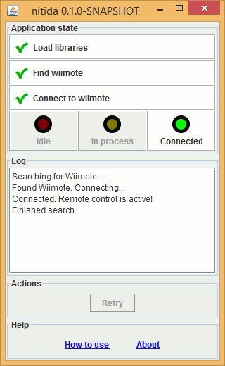

# nitida


A portable remote controller application, built on top of
[coronata](../coronata).

It currently works as a remote presenter.
Future use cases include game controller and media player controller.

## Highlights
- Small, portable app (single JAR file with less than 1MB)
- Cross-platform (tested on Windows and Linux)
- Easy to use (informative user interface)
- Few requirements:
  - Java Runtime Environment 1.6+
  - On Windows, pairing Bluetooth device
  - On Linux, installing a system package once

## [Usage](src/main/resources/com/github/awvalenti/bauhinia/nitida/how-to-use.md)
Refer to [usage.md](src/main/resources/com/github/awvalenti/bauhinia/nitida/how-to-use.md).

## Development
You are welcome to submit suggestions and bugs! Please [open an issue](../../../issues)
if you have one.

## License
[GPL v3](http://www.gnu.org/licenses/gpl-3.0.en.html)

```
nitida - Portable Wii Remote controller application.
Copyright (C) 2015 - 2017  Andre Willik Valenti

This program is free software: you can redistribute it and/or modify
it under the terms of the GNU General Public License as published by
the Free Software Foundation, either version 3 of the License, or
(at your option) any later version.

This program is distributed in the hope that it will be useful,
but WITHOUT ANY WARRANTY; without even the implied warranty of
MERCHANTABILITY or FITNESS FOR A PARTICULAR PURPOSE.  See the
GNU General Public License for more details.

You should have received a copy of the GNU General Public License
along with this program.  If not, see <http://www.gnu.org/licenses/>.
```
