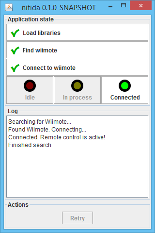

# nitida
A portable remote controller application, built on top of [forficata](../forficata).



## License
[GPL v3](http://www.gnu.org/licenses/gpl-3.0.en.html)

## Possible use cases
- Remote presenter
- Game controller
- Media player controller
- ...

## Highlights
- Small, portable app (single JAR with less than 1MB)
- Cross-platform (tested on Windows and Linux)
- Easy to use (informative user interface)
- Few requirements:
  - Java Runtime Environment 1.6+
  - On Windows, pairing Bluetooth device
  - On Linux, installing a system package once (```libbluetooth-dev``` on Ubuntu or derivatives - details [here](http://bluecove.org/bluecove-gpl/))

## How to use it
Simply download the JAR file and run it. A window should open and a connection attempt will be started.

You can also run it as a console application: ```java -jar nitida-x.y.z.jar --console```

## WIP
I'm currently working on improving its usability, which is not optimal yet.
