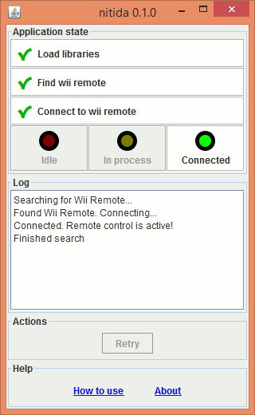

# nitida


A portable remote controller application, built on top of
[coronata](../coronata).

It currently works as a remote presenter.
Future use cases include game controller and media player controller.

## Highlights
- Small, portable app (single JAR file with less than 1MB)
- Cross-platform (tested on Windows and Linux)
- Easy to use (informative user interface)
- Few requirements:
  - Java Runtime Environment 1.6+
  - On Windows, pairing Bluetooth device
  - On Linux, installing a system package once

## How to use it
On Windows, first step is to pair the Wii Remote. Open the Bluetooth
configurations. Make the Wii Remote visible
by pressing buttons 1 + 2 simultaneously. Add it as a paired device without
using a code.
If the device is already added, remove it and add it again.
For more information, please check
[this tutorial](http://www.dolphin-emulator.com/connect-wiimote.html)
and/or [this video](https://www.youtube.com/watch?v=DIFARukwA5I).
Skip the parts dealing with the Dolphin emulator.

On Linux, install the appropriate system package as described on the
Requirements section of [this page](http://bluecove.org/bluecove-gpl/).
On Ubuntu or derivatives,
this is accomplished by running ```sudo apt-get install libbluetooth-dev```.

From the [releases page](https://github.com/awvalenti/bauhinia/releases),
download the latest nitida JAR file and run it. Double-clicking the file
should work. If it doesn't, you might want to try starting nitida via terminal:
```java -jar nitida-x.y.z.jar``` (replace ```x.y.z``` with the appropriate version).

A window should open and a connection
attempt will be started. On Linux, press buttons 1 + 2 simultaneously
on this moment to make the Wii Remote discoverable. On Windows, it is
already discoverable if previously paired as explained above.

You can also run nitida as a console application: ```java -jar nitida-x.y.z.jar --console```

## Development
Suggestions are welcome! Please [open an issue](../../../issues) if you have one.

## License
[GPL v3](http://www.gnu.org/licenses/gpl-3.0.en.html)

```
nitida - Portable Wii Remote controller application.
Copyright (C) 2015  Andre Willik Valenti

This program is free software: you can redistribute it and/or modify
it under the terms of the GNU General Public License as published by
the Free Software Foundation, either version 3 of the License, or
(at your option) any later version.

This program is distributed in the hope that it will be useful,
but WITHOUT ANY WARRANTY; without even the implied warranty of
MERCHANTABILITY or FITNESS FOR A PARTICULAR PURPOSE.  See the
GNU General Public License for more details.

You should have received a copy of the GNU General Public License
along with this program.  If not, see <http://www.gnu.org/licenses/>.
```
